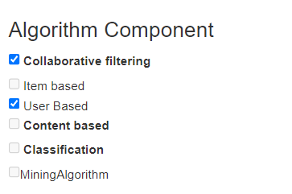
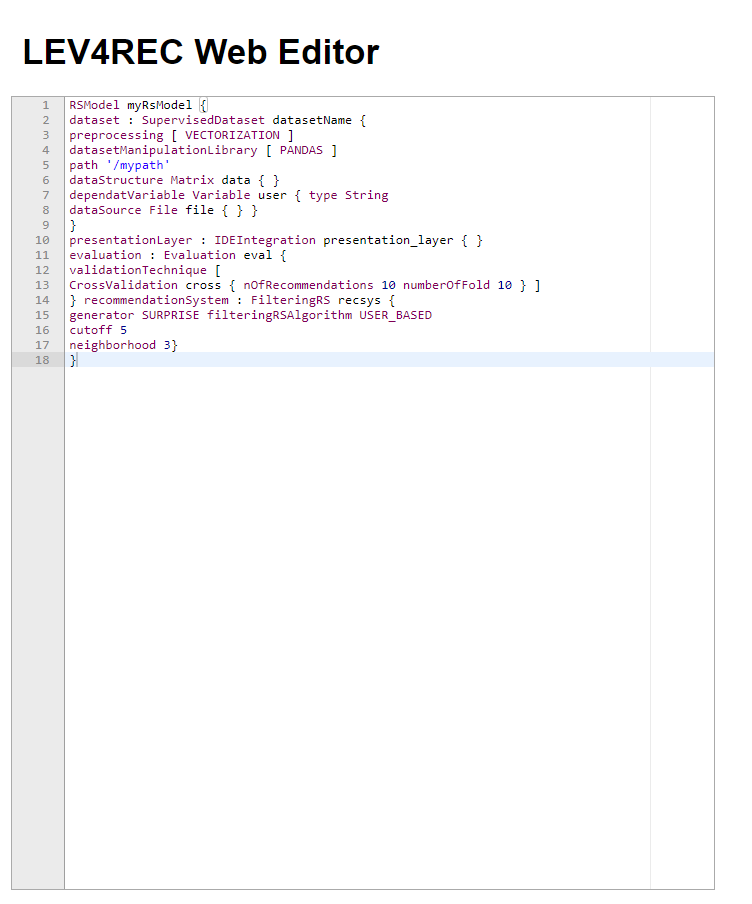
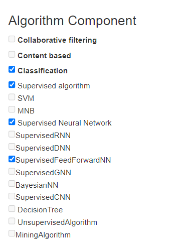
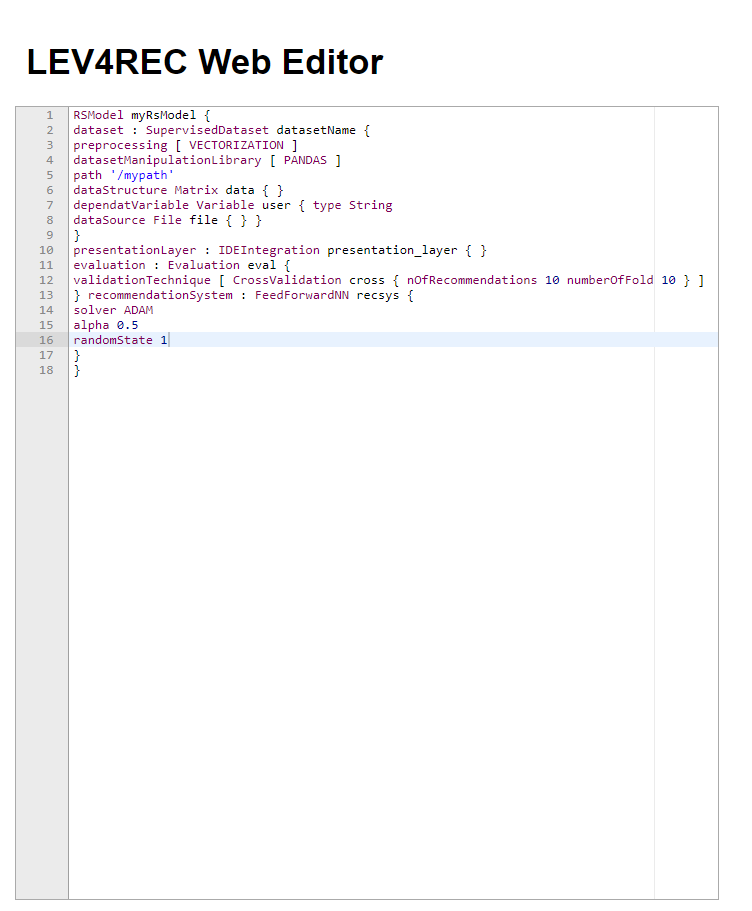

# LEV4REC-deployment
This repository contains the Docker configuration files for the deployment of LEV4REC.
The source code and development support is available at [https://github.com/MDEGroup/LEV4REC-Tool/](https://github.com/MDEGroup/LEV4REC-Tool)
You should conduct the following steps to run this setup:

1. (Re)Build the docker images using: 

	`docker-compose build`
	


2. Run the LEV4REC platform using: Please note that the last command can take more than 5 minutes, depending on the platform you are using. It needs to download all the dependencies.


	`docker-compose up` 


3. Access the LEV4Rec web app by using the following address in the web browser: 
[http://localhost:8891/lev4rec/](http://localhost:8891/lev4rec/).
The LEV4REC user guide is available at [https://github.com/MDEGroup/LEV4REC-Tool/blob/main/use_case_artifacts/Documentation/DSL_wiki.md](https://github.com/MDEGroup/LEV4REC-Tool/blob/main/use_case_artifacts/Documentation/DSL_wiki.md)


## Docker-compose

In case you want to make sure to start from a fresh installation, please execute the following command:

```
docker system prune -a --volumes
```


## Use cases
We use LEV4REC to design, tune, and deploy two existing recommender systems:

1. a k-nearest neighbor-based algorithm (named KNN hereafter) that aims to address the scalability problem in personalized recommendations (a predefined form is available at [http://localhost:8891/lev4rec/knn](http://localhost:8891/lev4rec/knn)) and
2. AURORA, a feed-forward neural network trained with a curated labeled dataset (a predefined form is available at [http://localhost:8891/lev4rec/ml](http://localhost:8891/lev4rec/ml)).

We make available the output of KNN in the [output_sample](https://github.com/MDEGroup/LEV4REC-deployment/tree/master/output_sample). A detailed guide on how to run the generated artifacts is available in each supported presentation layer, i.e., [evaluation by Python script](https://github.com/MDEGroup/LEV4REC-deployment/tree/master/output_sample/evaluation), [docker container with Jupyter notebook](https://github.com/MDEGroup/LEV4REC-deployment/tree/master/output_sample/notebook), and a [web services by flask](https://github.com/MDEGroup/LEV4REC-deployment/tree/master/output_sample/services).


### Replicating the use cases


#### KNN Algorithm

Using the RS Configuration Form, the user can specify the KNN algorithm as follows: 




Afterward, the user can fine-tune the specification by adding additional parameters. The whole KNN settings should be similar to the following:





### ML-based approach

The procedure can be followed to AURORA, a classification approach based on a feed-forward neural network. 

First, the user can select the proper type of network from the RS Configuration form:




Once all the components have been selected, LEV4REC generates automatically the DSL string that the user can customize:




### Acceleo Templates

Once the user has enhanced the system's specification using the web editor, the corresponding implementation can be generated by using the 'Generate' button available in the form. We employ a dedicated Acceleo template [generate.mtl ](https://github.com/MDEGroup/LEV4REC-Tool/tree/main/lev4rec/bundles/lev4rec.code.template/src/lev4rec/code/template/main) file that has been fed directly with the DSL string contained in the form.  


